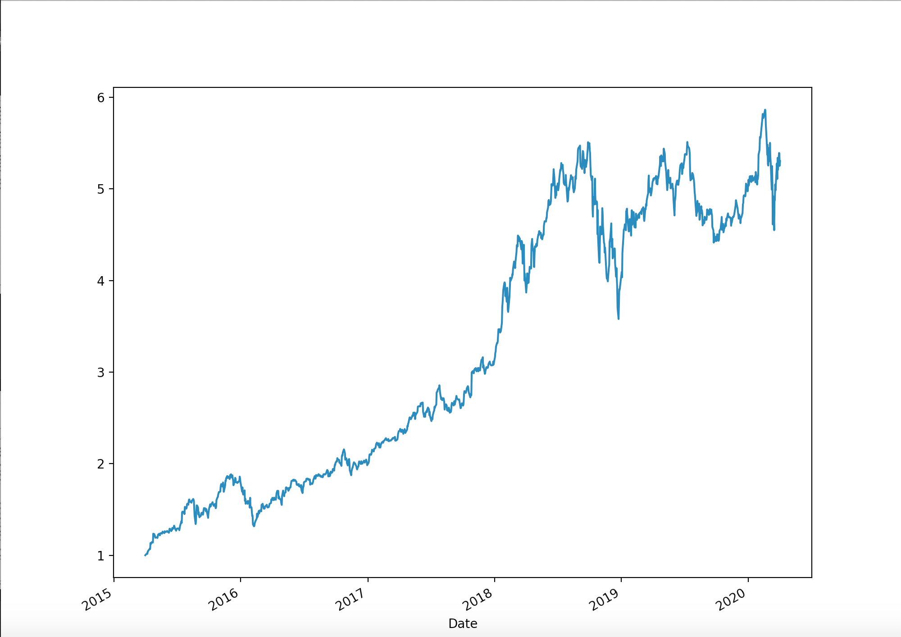
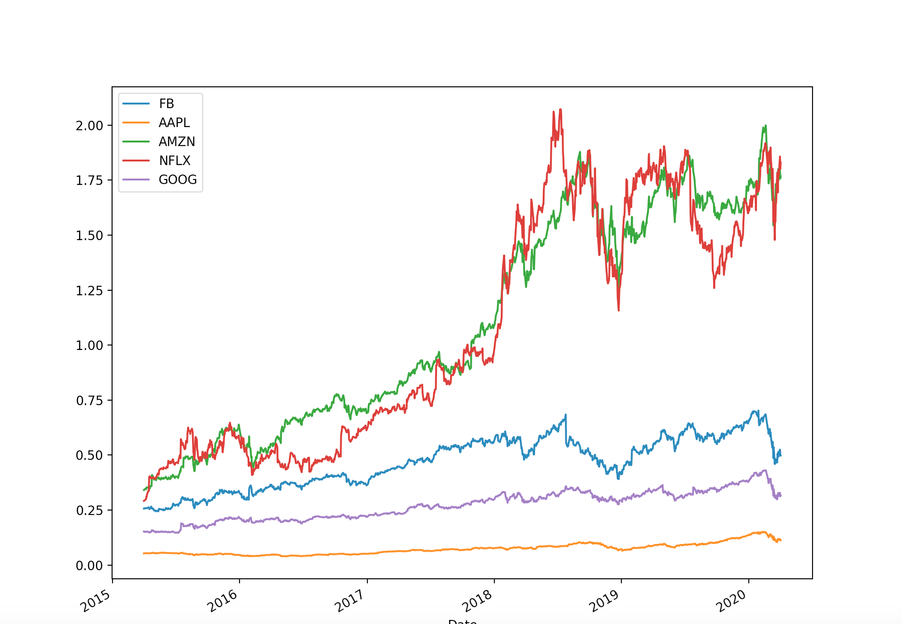
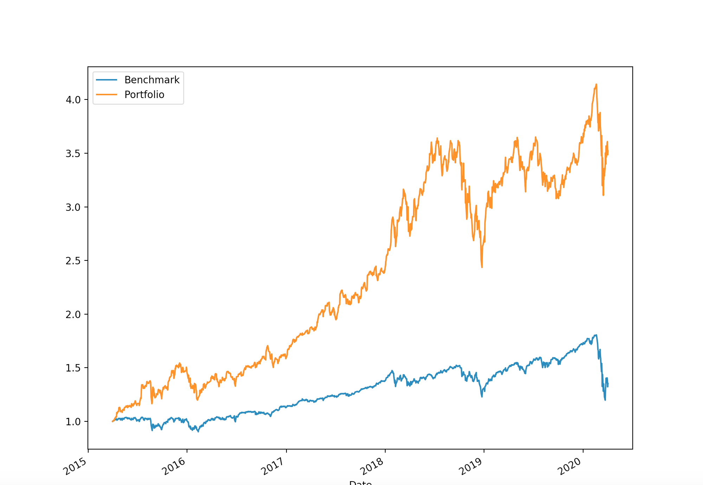

# Portfolio Optimization

Currently working on making a more intuitive CLI but see below for how to get a plot of monte carlo simulation

## How to Run

Scroll to the bottom of the Efficient_Frontier.py file
and imput the stock tickers and the dates for which you
would like to optimize over. Example stocks used are Facebook, Apple, Amazon, Netflix, Google. From 04-01-2015 to 04-02-2020.

Note the longer the time period the longer the optimization will take.

Then save and openup the terminal and type

```
python -i Efficient_Frontier.py
# Look at stocks
stocks
# Look at log returns
log_ret
```

#

Methods:

average_daily_return(stocks): Returns Average Daily returns

correlation_matrix(stocks): Returns a correlation matrix of stocks

log_returns(stocks): Returns dataframe fo Log Returns

normal_returns(stocks): Returns Dataframe of Normal Returns

#

Run a monte carlo simulation for optimal weights:

```python
# 10000 is the number of portfolios you want to generate
mc = monte_carlo(stocks,10000)

opt_sharpe_ratio, opt_allocation = get_optimal_weights(mc)
# OS: Optimal (opt) Sharpe Ratio, MV: Max vol of opt Sharpe Ratio, MR: Max return of opt sharpe ratio

plot_monte_carlo(mc,opt_sharpe_ratio)

# Generate PF timeseries with optimal allocations
pf = generate_portfolio_timeseries(normal_ret, opt_allocation)

# plot
plot_portfolio(pf)

plot_portfolio_breakdown(pf)

plot_against_benchmark(pf, spy_etf_returns)

```

### Visualize:

#

#### plot_hist_returns(log_ret)


#

#### plot_monte_carlo(mc,opt_weights)

Red dot represents the portfolio with the highest sharpe ratio.


#

#### plot_portfolio(pf_returns)

Displays returns of portfolio with the optimal weights. Example:



#

#### plot_portfolio_breakdown(pf_returns)

Displays the returns of individual stocks with their allocated weight. example:



#

#### plot_against_benchmark(pf_returns, benchmark)

Plots the portfolio returns against benchmark


